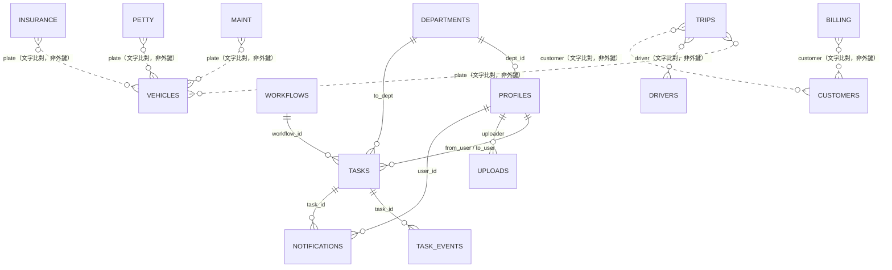

# 資料字典

本文件依 repo 現況（`supabase/schema-v2.sql`、`supabase/schema-v3.sql`、
`js/core.js` 裡 `M` 物件的 `fields` 定義）整理，不是憑空編寫。業務表
（`trips`/`maint`/`petty`/`billing`/`insurance`/`docs`/`vehicles`/`drivers`/
`customers`）沒有留下 CREATE TABLE 的 SQL 檔，只有 `schema-v2.sql` 裡
假設表已存在、對這些表套用 RLS 的迴圈，所以這幾張表的欄位定義以前端
`M` 物件為準——這也是系統實際讀寫資料庫時唯一依據的欄位清單。

> 重要設計特徵：業務表與 `vehicles`/`drivers`/`customers` 之間**不是**
> 資料庫外鍵關聯，而是用文字比對（車號字串、姓名字串）在前端做查詢/
> 篩選（例如 `maint.plate` 只是一個文字欄位，剛好常常等於某台
> `vehicles.plate`）。好處是匯入舊 Excel 資料時不用先建好對應的
> 車輛/駕駛/客戶紀錄；代價是改車號或改駕駛姓名不會回溯更新舊紀錄。

## 業務資料表

### trips（出車報班）
| 欄位 | 型別 | 意思 | 誰會填 | 可否為空 |
|---|---|---|---|---|
| date | date | 出車日期，預設今天 | 司機/調度 | 否 |
| plate | text | 車號（對應 vehicles.plate 的文字比對，非外鍵） | 司機/調度 | 否 |
| driver | text | 駕駛姓名（對應 drivers.name） | 司機/調度 | 否 |
| customer | text | 客戶名稱（對應 customers.name） | 司機/調度 | 是 |
| from / to | text | 起點／迄點 | 司機/調度 | 是 |
| trips | number | 趟次 | 司機/調度 | 是 |
| weight | number | 噸數／件數 | 司機/調度 | 是 |
| freight | number | 運費（金額） | 司機/調度 | 是（有填才算業績） |
| bonus | number | 加班／獎金 | 司機/調度 | 是 |
| deduct | number | 扣款 | 司機/調度 | 是 |
| note | text | 備註 | 司機/調度 | 是 |

### maint（車輛維修）
| 欄位 | 型別 | 意思 | 誰會填 | 可否為空 |
|---|---|---|---|---|
| plate | text | 車號 | 修配/調度 | 否 |
| date / done | date | 進廠日期／完工日期 | 修配 | date 否，done 可空（還沒修完） |
| driver | text | 駕駛姓名 | 修配 | 是 |
| vendor | text | 維修廠商（自由輸入，會記憶歷史選項） | 修配 | 是 |
| cat | text | 維修類別（定期保養/輪胎/煞車系統…） | 修配 | 是 |
| items | text | 維修項目說明 | 修配 | 是 |
| labor / parts | number | 工資／零件費 | 修配 | 是 |
| amount | number | 合計（可自動加總 labor+parts，也能手動改） | 修配 | 否 |
| **paid** | text | **「未付／已付」**——這筆維修費是否已付給廠商 | 會計 | 是（預設未付邏輯由畫面決定） |
| mileage / next | number | 里程數／下次保養里程 | 修配 | 是 |
| invoice | text | 發票號碼 | 會計 | 是 |
| note | text | 備註 | 修配 | 是 |
| scans | jsonb（路徑陣列） | 單據照片，存 Storage 路徑（見 `docs/tools/supabase.md`） | 修配 | 是 |

### petty（零用金）
date、cat（油資/過路費/停車費…）、item（品名/用途，必填）、amount（必填）、
payer（付款人，自由輸入）、plate（相關車號，可空）、invoice、note、scans。

### billing（客戶對帳）
| 欄位 | 型別 | 意思 |
|---|---|---|
| date | date | 日期 |
| kind | text | 「銷項」（我方開給客戶）或「進項」（廠商開給我方） |
| customer | text | 客戶／廠商名稱（必填） |
| invoice / period | text | 發票號碼／所屬期別 |
| amount / tax | number | 金額（未稅）／稅額 |
| **paid** | text | **「未收／已收」**——這筆帳款是否已收到錢，跟 maint 的 paid 意思不同（一個是我方付錢給廠商，一個是客戶付錢給我方） |
| paydate | date | 收款日 |
| note / scans | — | 備註／單據照片 |

### insurance（保險／到期）
plate（必填）、cat（強制險/第三人責任險/車體險/貨物險/定期檢驗/牌照稅/
燃料費/營業執照）、company（保險公司或機關，自由輸入）、policy（保單/證號）、
start/end（生效日/到期日，end 必填，總覽頁「45 天內到期」靠這欄算）、
premium（保費/規費）、paid（「未付／已付」，跟 maint 同義：這筆保費/規費
是否已繳）、note、scans。

### docs（公文合約建檔）
date、cat（公文/合約/信件/切結書/報價單/其他）、title（主旨，必填）、
party（來文者/對象）、docno（文號）、tags（分類標籤，自由文字）、
due（期限/到期）、note、scans。

### vehicles / drivers / customers（基本資料）
- **vehicles**：plate（必填）、vtype（曳引車/半拖車/貨車/吊車/其他）、
  driver（固定駕駛姓名）、status（在用/維修中/停用）、note
- **drivers**：name（必填）、phone、base（底薪）、rate（每趟抽成金額）、
  pct（運費抽成％）、status（在職/離職）、note
- **customers**：name（必填）、tax（統一編號）、contact、phone、
  kind（客戶/廠商/兩者）、note

## 帳號與流程相關表（`supabase/schema-v2.sql` / `schema-v3.sql`）

### profiles
| 欄位 | 意思 | 可否為空 |
|---|---|---|
| id | = `auth.users.id`，登入帳號本體 | 否 |
| email / name | 顯示用 | email 否，name 否（註冊時帶入或用 email 代替） |
| role | `user` / `admin`。系統第一個註冊的人自動變 admin | 否 |
| status | `pending`（待審核）/ `active`（啟用）/ `suspended`（停權），第一人自動 active，其餘 pending | 否 |
| perms | jsonb，模組權限鍵值（`trips`/`maint`/…/`workflow`/`tasks`/`uploads`/`admin` 等，見 `js/core.js` 的 `MODLIST`） | 否（預設 `{}`） |
| dept_id | 所屬部門，v3 新增 | 是 |

### departments
id、name（部門名稱）、sort（排序）。預設值：行政/會計/調度/修配/業務。

### workflows（流程範本）
id、name、module（適用哪個業務模組）、steps（jsonb 陣列，每步含
`name`/`dept_id`/`user_id`/`action`，action 是 `process`（處理）/
`review`（審核）/`notify`（知會））、active。

### tasks（工作單）
title、module + ref_id（指向哪個業務模組的哪一筆，非資料庫外鍵層級強制，
是應用層對應）、workflow_id + step（走到流程的第幾步）、status（open/
done/cancelled）、from_user/to_user/to_dept（誰送出、指派給誰或哪個部門）、
priority（low/normal/high）、due、note、files（附件的 uploads 路徑陣列）。

### task_events（工作單處理紀錄，只增不刪）
task_id、actor（誰做的）、action（create/transfer/comment/approve/reject/
done）、from_user/to_user/to_dept（轉交時的來源去向）、comment。

### notifications（站內通知）
user_id（誰的通知）、task_id、kind、title、body、read_at。由
`notify_task_assignment()` trigger 在 tasks 指派變動時自動建立，使用者
不能自己新增，只能讀/標記已讀自己的。

### uploads（檔案庫 metadata）
path（Storage 內路徑）、name、mime、size、module + ref_id（可選，關聯到
哪個業務模組的哪一筆）、uploader。

### agent_alerts（Claude Code 回報）
level（action/info/done）、title、body、session（區分不同次執行）、
resolved_at。只有 admin 能讀，一般使用者不受影響。

## 原始層／匯入紀錄（`supabase/migrations/schema-v4-raw-layer.sql`）

跟業務表的匯入方式（`js/importer.js`，欄位對欄位直接寫進業務表）是平行的
另一條路線：整份 Excel 每一列原封不動存進 `raw_records.raw`（JSONB），
不做任何欄位裁切或型態轉換，下個月 Excel 欄位變了也不用改表結構。
畫面見 `js/raw-import.js`（匯入、匯入紀錄）與 `js/raw-view.js`（顯示、
欄位對照設定）。

### import_batches（匯入批次）
| 欄位 | 意思 |
|---|---|
| file_name / file_hash | 檔案名稱／檔案指紋（SHA-256），同指紋再匯會提示「這個檔案匯過」但不會擋 |
| data_type | 資料類型標籤，使用者自訂文字（例如「司機薪資表」） |
| period | 所屬期間（年月，可空） |
| imported_by / imported_at | 匯入者／匯入時間 |
| total_rows | 該批總列數 |
| status | 進行中／完成／已撤銷。撤銷不刪這筆紀錄，只改狀態，讓使用者看得到匯過幾次 |
| note | 備註 |

### raw_records（原始資料）
batch_id（外鍵，ON DELETE CASCADE）、row_no（原始列號）、
raw（JSONB，整列原始內容）、created_at。對 `raw` 建 GIN 索引，
對 `batch_id` 建一般索引。整批撤銷＝刪除該批全部 `raw_records`（`import_batches`
那筆紀錄保留、狀態改「已撤銷」）。

### field_mappings（欄位對照設定）
data_type（對應 `import_batches.data_type`）、source_field（原始欄位名，
掃描該資料類型底下所有 `raw_records.raw` 出現過的 key）、display_name
（顯示名稱）、sort_order（顯示順序）、type_hint（文字／數字／日期，只是
提示不會自動轉型）、visible（是否顯示）。`(data_type, source_field)`
唯一，畫面用 upsert（`on_conflict`）寫入。「資料顯示」畫面依這份設定
把 `raw` 裡對應欄位撈出來呈現：查不到的欄位顯示「查無此欄」，型態跟
`type_hint` 對不上的在該格標示異常，兩者都不會自動轉型或補值。

## 關聯圖（Mermaid）

## 權限（RLS）摘要
所有表都開了 Row Level Security：
- 業務表（trips/maint/petty/billing/insurance/docs/vehicles/drivers/customers）
  用 `has_perm(module)` 判斷，`vehicles`/`drivers`/`customers` 共用權限鍵
  `masters`。
- `profiles`：自己可讀自己那筆，admin 可讀/改全部，沒有人可以刪除。
- `tasks`/`task_events`/`notifications`：依 `from_user`/`to_user`/
  `to_dept`/`user_id` 判斷是否跟自己有關，admin 一律可見。
- `agent_alerts`：只有 admin 能讀，一般使用者完全看不到這張表。
- `import_batches`/`raw_records`/`field_mappings`：依 `imports.view`/
  `imports.create`/`imports.revoke`/`mappings.view`/`mappings.edit`
  五把新權限鍵判斷（`has_perm()` 機制）。

詳細 SQL 見 `supabase/schema-v2.sql`、`supabase/schema-v3.sql`。
